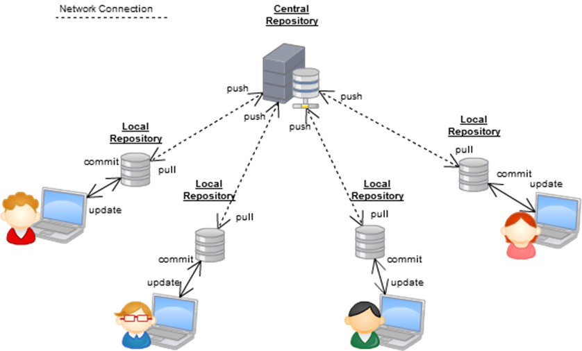

## GIT
---
### *Что такое GIT ?*

- ***Git*** - распределённая система управления версиями. Проект был создан Линусом Торвальдсом для управления разработкой ядра Linux, первая версия выпущена 7 апреля 2005 года. На сегодняшний день его поддерживает Джунио Хамано.

### *Популярные проекты использующие git:*

 - Среди проектов, использующих Git, — ядро Linux, Swift, Android, Drupal, Cairo, GNU Core Utilities, Mesa, Wine, Chromium, Compiz Fusion, FlightGear, jQuery, PHP, NASM, MediaWiki, DokuWiki, Qt, ряд дистрибутивов Linux.

### ***Схема работы GIT:*** 

---
### *История*

- Разработка ядра Linux велась на проприетарной системе BitKeeper, которую автор — Ларри Маквой, сам разработчик Linux — предоставил проекту по бесплатной лицензии. Разработчики, написали несколько утилит, и для одной Эндрю Триджелл произвёл реверс-инжиниринг формата передачи данных BitKeeper. В ответ Маквой обвинил разработчиков в нарушении соглашения и отозвал лицензию, и Торвальдс взялся за новую систему: ни одна из открытых систем не позволяла тысячам программистов кооперировать свои усилия (тот же конфликт привёл к написанию Mercurial). Идеология была проста: взять подход CVS и перевернуть с ног на голову, и заодно добавить надёжности.

